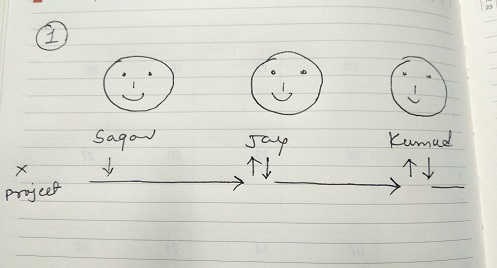
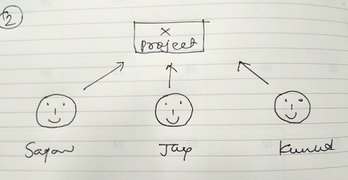
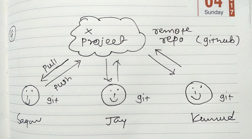
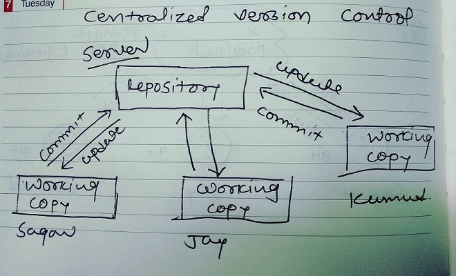
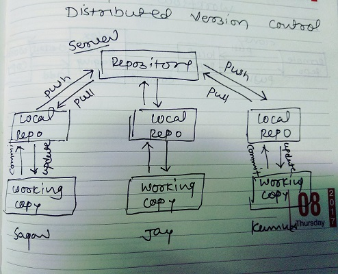
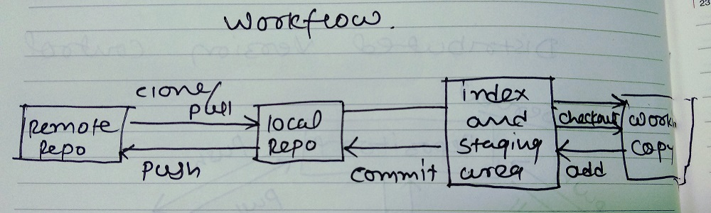
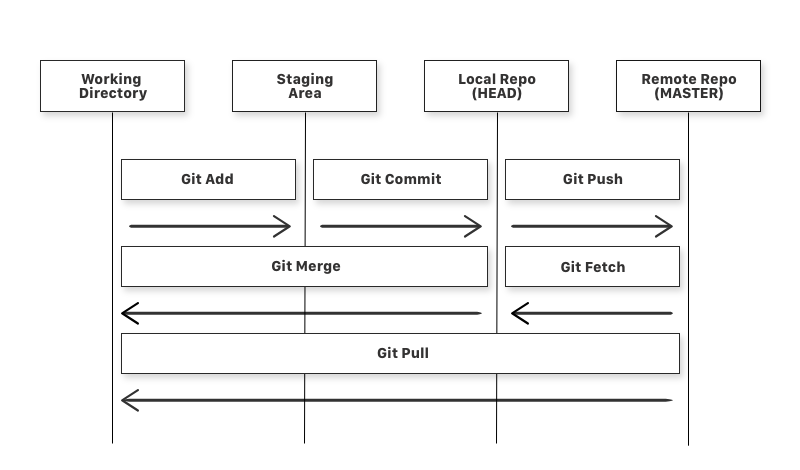

# git-tutorial
Topics of learning git and github in simple way. :blush:

## Getting Started

### Prerequisites

- GIT installed on your machine. If not, you can download it from [official site](https://git-scm.com/downloads)
- Account on [github.com](https://github.com/)

## Why to use GIT ?

1. What was a challanges for developers?



2. What was another solution?



3. What to do now?


4. Version Control System



## Introduction

* [What is GIT](#what-is-git)
* [What is GITHUB](#what-is-github)
* [Is GIT related to GITHUB](#is-git-related-to-github)
* [A simple workflow](#a-simple-workflow)


### What is GIT
- VCS (Version Control System)
- track files/folders
- to work in team
- free and opensource

Two types of VCS
1. Centralized version control



2. Distributed version control



So git is distributed version control system.


### What is GITHUB

- Website/Server to upload repository
- Backup functionality
- GUI for repo
- Manage team

### What is a repo

A repository a.k.a. repo is nothing but a collection of source code.

### Is GIT related to GITHUB

NO !!!!!!
GIT can also be used with others repository management system like bitbucket.

### A simple workflow





## Setup Repository

1. Run `$ git init` command or you can directly clon repo using `git clone <repo_url>`
2. Link remote repository with local using `$ git remote add origin <repo url>` command
3. Add project files to folder and adding it to stage area via `$ git add .` command
4. Commit staged files with `$ git commit -m <Message>` command
5. pull latest changes in local repo `$ git pull origin master`
6. Push all local repository commits to remote `$ git push origin master`

## General Commands

* `git add` is a command used to add a file that is in the working directory to the staging area.

* `git commit` is a command used to add all files that are staged to the local repository.

* `git push` is a command used to add all committed files in the local repository to the remote repository. So in the remote repository, all files and changes will be visible to anyone with access to the remote repository.

* `git fetch` is a command used to get files from the remote repository to the local repository but not into the working directory.

* `git merge` is a command used to get the files from the local repository into the working directory.

* `git pull` is command used to get files from the remote repository directly into the working directory. It is equivalent to a `git fetch` and a `git merge` .

* Other useful commands: `git status`, `git log`, `git reset`, `git diff`


## Branching

1. what are branches & commands?
- Feature/Task wise branch
- commands for create, checkout, merge & delete

#### Create Branch

`$ git branch <branch name>`

you're still on ``master`` branch so for adding new features, you have to swicth on newly created branch. Follow next **checkout** step.

#### Checkout Branch

`$ git checkout <branch name>`

Add new fetaures in your working repo and push it on remote repo. Now you can see new branch in branch list of github.

#### Merge Branch

`$ git merge <source branch name>`

Add new fetaures in your working repo and push it on remote repo. Now you can see new branch in branch list of github.

#### Delete Branch

`$ git branch -d <branch name>` - From local repo

`$ git push origin -d <branch name>` - From remote repo

## Tags/Releases

Specific points in history for repository called as release or versions.

### Create Tag

Cretae tag in local repository

`$ git tag <tag name>`

### Show Tag(s)

Show list of tags in local repository

`$ git tag`

`$ git show <tag name>`

### Push Tag

Push tag to remote repository

`$ git push origin <tag name>`

### Delete Tag

Delete tag from repository

`$ git tag -d <tag name>` - From local repo

`$ git push origin -d <tag name>` - From remote repo


#### Checkout Tag

No concept for checkout tags, but if you want it then you can create a branch with specific tag

`$ git checkout -b <branch name> <tag name>`

### Revert back to the last committed version to the Git Repo

`$ git checkout .`


## One More Thing:

```.gitignore```

So what is it?

`.gitignore` tells git which files (or patterns) it should ignore. It's usually used to avoid committing transient files from your working directory that aren't useful to other collaborators, such as compilation products, temporary files IDEs create, etc.

---
Thanks

> ## Made by Kumu with :heart:
